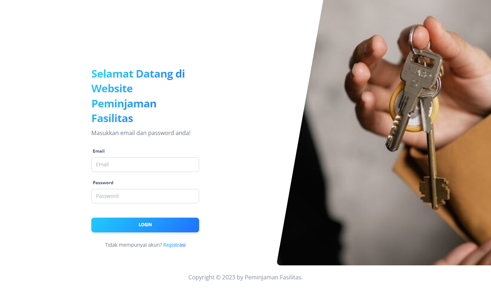
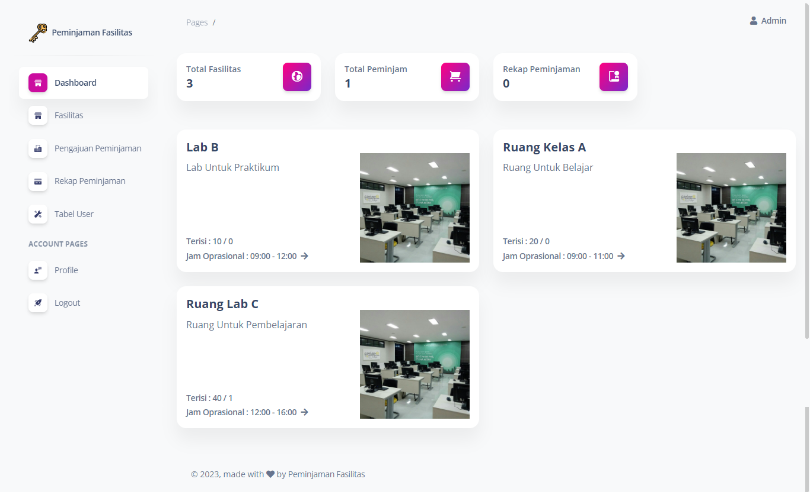
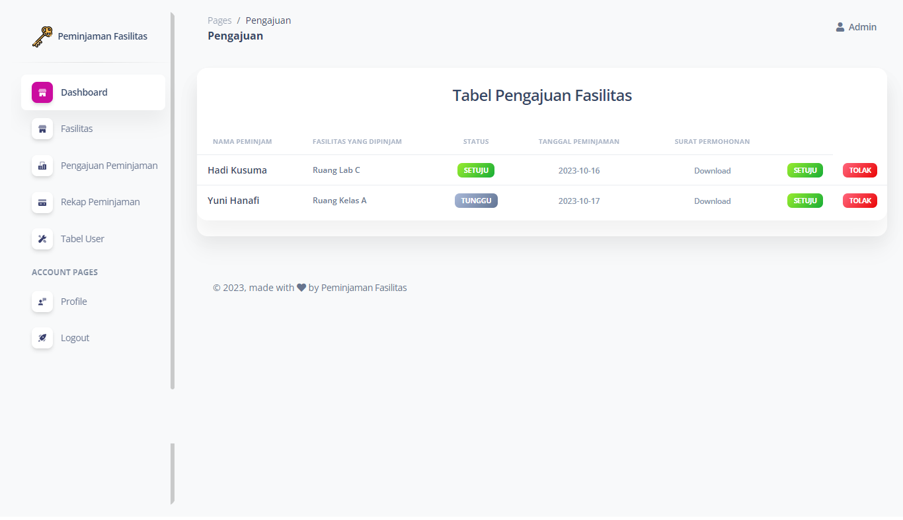
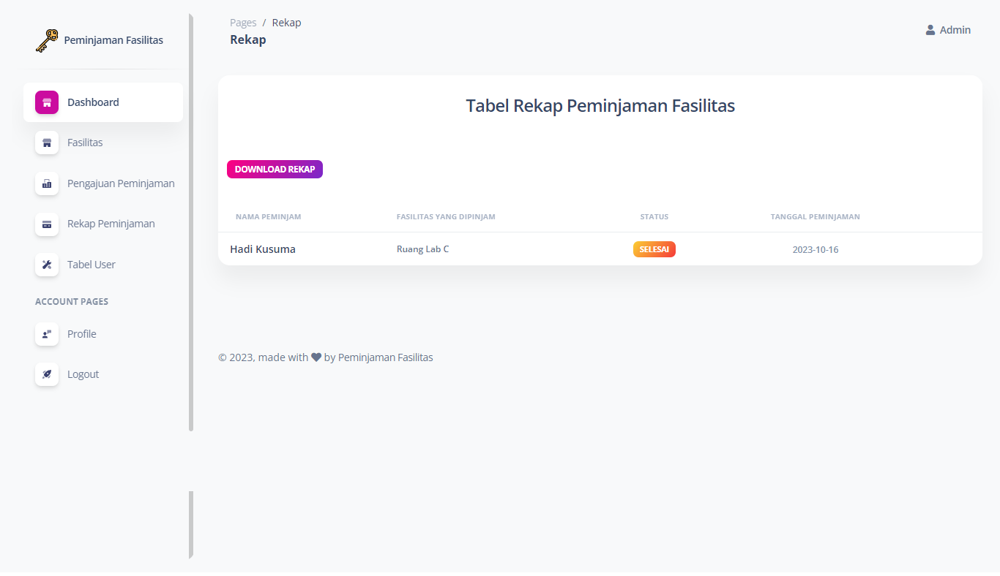
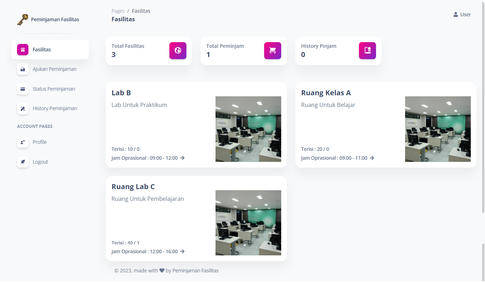
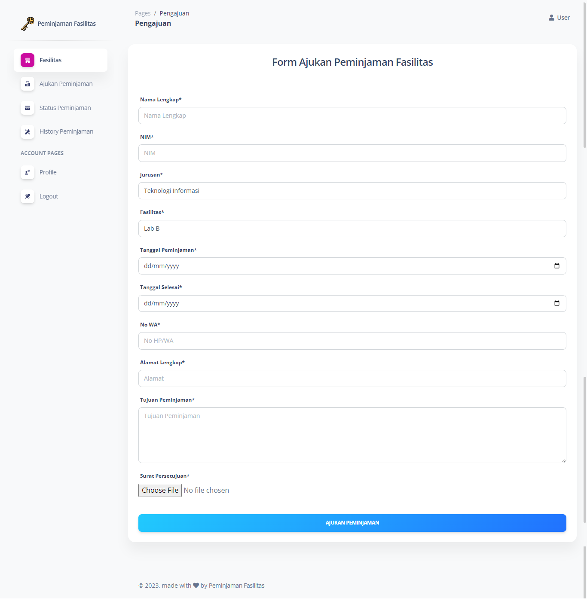
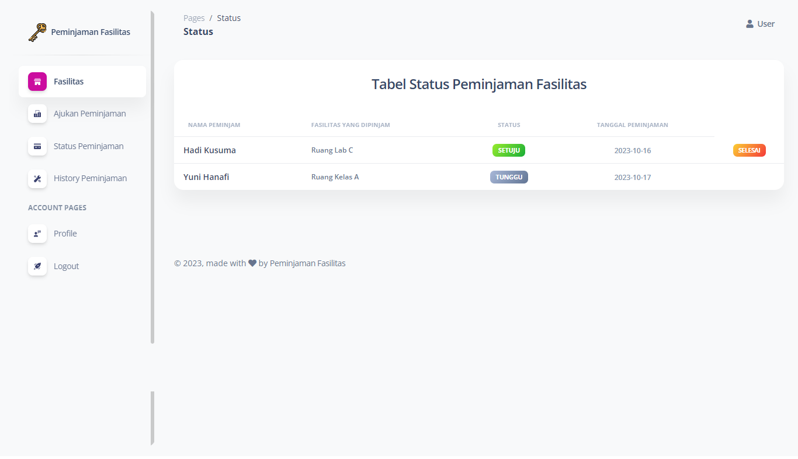
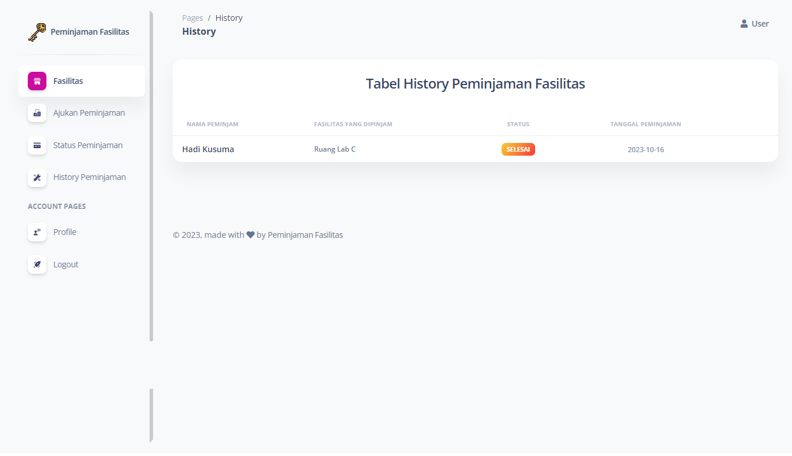

# Website Peminjaman Fasilitas

Website Peminjaman Fasilitas adalah portal peminjaman fasilitas yang memudahkan Anda untuk mengakses dan memanfaatkan berbagai fasilitas dengan cepat dan efisien. Di sini, kami menyediakan platform yang ramah pengguna untuk mempermudah proses peminjaman ruang pertemuan, peralatan, kendaraan, dan fasilitas lainnya sesuai kebutuhan Anda.

Proyek ini dibangun dengan menggunakan Laravel, Boostrap, dan Mysql untuk manajemen database.
## Teknologi Yang Digunakan 

Framework : Laravel, Boostrap

Database : Mysql

## Screenshoot

### Admin









### User









## Prasyarat

Pastikan Anda telah menginstal [Laravel](https://laravel.com/) dan [Composer](https://getcomposer.org/) di sistem Anda sebelum menjalankan proyek ini.

## Instalasi

1. Clone repositori ini:

   ```bash
   git clone https://github.com/AdeMariaUlfa/peminjaman.git
   ```
   
2. Masuk ke direktori proyek:

   ```bash
   cd peminjaman
   ```

3. Salin file .env.example menjadi .env dan sesuaikan pengaturan database:

   ```bash
   cp .env.example .env
   ```

4. Jalankan perintah berikut untuk menginstal dependensi:

   ```bash
   composer install
   ```

5. Install dependensi JavaScript menggunakan npm:

   ```bash
   npm install
   ```

6. Generate key aplikasi Laravel:

   ```bash
   php artisan key:generate
   ```
7. Migrasi dan isi database dengan perintah berikut:

   ```bash
   php artisan migrate --seed
   ```

8. Jalankan server pengembangan Laravel

   ```bash
   php artisan serve
   ```
